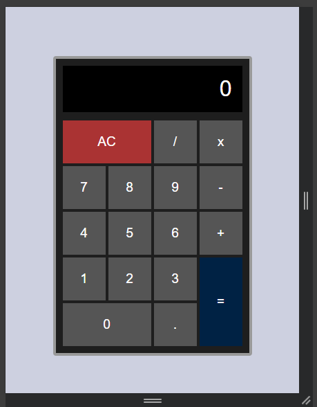

# Kalkulator Sederhana

Proyek ini adalah tugas **Week 3 Bootcamp Fullstack – Sinau Koding**.
Aplikasi ini merupakan kalkulator berbasis web, dibuat menggunakan **HTML, CSS, dan JavaScript**.

## ✨ Fitur

- Operasi dasar: penjumlahan, pengurangan, perkalian, pembagian.
- Tombol `AC` untuk menghapus semua input.
- Tampilan responsif dan layout grid.

## 🛠️ Teknologi

- **HTML5** untuk struktur halaman.
- **CSS3** (Flex & Grid) untuk styling.
- **JavaScript** untuk logika kalkulasi.

## 📸 Preview

