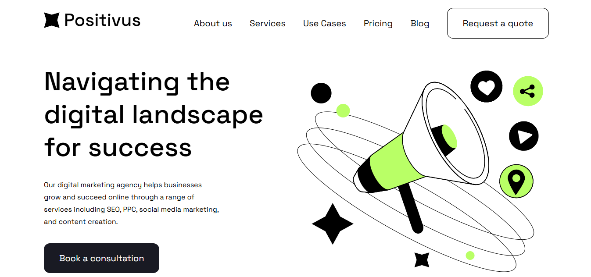

# Positivus Landing Page Slicing

Proyek ini adalah implementasi _front-end_ (slicing) dari desain **Positivus Landing Page** yang tersedia di Figma. Dibuat dengan tujuan untuk menerjemahkan desain UI/UX menjadi kode yang fungsional dan terstruktur menggunakan teknologi web modern.

**Link Penting:**

- **Live Demo:** [**positivus-v1.vercel.app**](https://positivus.vercel.app/)
- **Desain Figma:** [**Positivus Landing Page Design**](https://www.figma.com/design/g7m48KXSguW0UE6ewPY9Gr/Positivus-Landing-Page-Design--Community-?node-id=330-762)

---

## ✨ Fitur yang Sudah Diimplementasikan

- **Header & Navigation Bar**,
- **Hero Section**,
- **Clients/Partners Logo**,
- **Services Section**,
- **Banner Section**,
- **Case Studies Section**,
- **Working Process Section**,
- **Teams Section**

---

## 🛠️ Tech Stack

Proyek ini dibangun menggunakan _stack_ teknologi modern yang fokus pada _developer experience_ dan performa.

- **Framework:** [**React**](https://react.dev/)
- **Language:** [**TypeScript**](https://www.typescriptlang.org/)
- **Styling:** [**Tailwind CSS**](https://tailwindcss.com/)
- **Build Tool:** [**Vite**](https://vitejs.dev/)
- **Deployment:** [**Vercel**](https://vercel.com/)

---

## 📝 Status & Rencana Pengembangan

Proyek ini masih dalam tahap pengembangan. Berikut adalah daftar tugas yang perlu diselesaikan:

### To-Do List

- [ ] **Slicing Section Testimonial:** Mengimplementasikan komponen untuk menampilkan testimoni klien.
- [ ] **Slicing Section Contact Us:** Membuat formulir kontak dan informasi relevan.
- [ ] **Slicing Footer:** Membangun bagian _footer_ sesuai desain.
- [ ] **Implementasi Responsivitas:** Menyesuaikan _layout_ agar tampil baik di berbagai ukuran layar (mobile, tablet, desktop).
- [ ] **Refactoring & Code Cleanup:** Merapikan kode dan memastikan struktur komponen sudah optimal.
- [ ] **Menambahkan Interaktivitas:** Memberi efek transisi atau animasi sederhana untuk meningkatkan _user experience_.

### Status Saat Ini

- **Responsiveness:** Belum sepenuhnya responsif. Tampilan saat ini dioptimalkan untuk desktop.
- **Kelengkapan Halaman:** Sekitar 70% dari total desain halaman utama telah selesai di-slicing.

---

Terima kasih telah mengunjungi repository ini!
