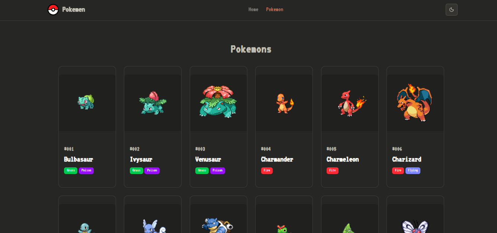

# Pokemen Web App

Selamat datang di Pokemen Web App! Ini adalah aplikasi web yang menampilkan informasi mengenai semua Pokemon yang ada dalam PokeAPI.

[](https://pokemens.ffathur.my.id)

## ✨ Fitur Utama

- **Daftar Pokemon**: Menampilkan daftar seluruh Pokemon dengan sistem paginasi yang mudah digunakan.
- **Halaman Detail**: Halaman detail yang kaya informasi untuk setiap Pokemon, termasuk statistik, tipe, kemampuan, tinggi, dan berat.
- **Desain Responsif**: Tampilan yang optimal di berbagai perangkat, mulai dari desktop hingga mobile.
- **Mode Gelap & Terang**: Terdapat toggle untuk mengubah tema sesuai preferensi pengguna.
- **Animasi**: Dibangun dengan Framer Motion untuk memberikan transisi dan pengalaman pengguna yang lebih hidup.
- **Antarmuka Modern**: UI yang bersih dan modern dirancang menggunakan Tailwind CSS dan shadcn/ui.

## 🛠️ Teknologi yang Digunakan

- **Frontend**: React & TypeScript
- **Routing**: React Router
- **Styling**: Tailwind CSS + shadcn/ui
- **Animasi**: Framer Motion
- **UI Components**: shadcn/ui (komponen yang dapat diakses dan dapat dikustomisasi)
- **Data**: PokeAPI (melalui [Pokenode-ts](https://github.com/Gabb-c/pokenode-ts)) - Library TypeScript dengan auto-caching
- **Deployment**: Vercel

## 🔧 Konfigurasi UI Components

Proyek ini menggunakan [shadcn/ui](https://ui.shadcn.com/) untuk komponen UI yang dapat diakses dan dapat dikustomisasi. Beberapa komponen yang digunakan termasuk:

- **Button**
- **Card**
- **Alert**
- **Badge**
- **Progress Bar**
- **Dan lainnya**

Untuk informasi lebih lanjut tentang konfigurasi UI components, silakan kunjungi [shadcn/ui](https://ui.shadcn.com/).

## 🔧 Konfigurasi API

Aplikasi ini menggunakan [Pokenode-ts](https://github.com/Gabb-c/pokenode-ts), sebuah wrapper TypeScript untuk PokeAPI yang menyediakan:

- **Type Safety**: Type definitions lengkap untuk semua data Pokemon
- **Auto Caching**: Performa optimal dengan caching otomatis

Meskipun menggunakan Pokenode-ts, data tetap diambil dari [pokeapi.co](https://pokeapi.co/api/v2) secara underlying.

---

## 📦 Instalasi & Menjalankan Secara Lokal

1. **Clone repositori**

2. **Install dependencies**

   ```bash
   bun install
   ```

3. **Jalankan server development**

   ```bash
   bun dev
   ```

4. **Buka di browser**
   Akses [http://localhost:5173](http://localhost:5173) (atau port yang muncul di terminal).

---

## 🌐 Deployment

Aplikasi ini telah di-deploy dan dapat diakses publik melalui:

**🌍 [pokemens.ffathur.my.id](https://pokemens.ffathur.my.id)**
